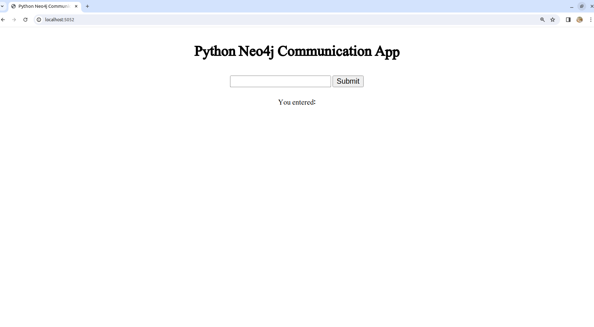
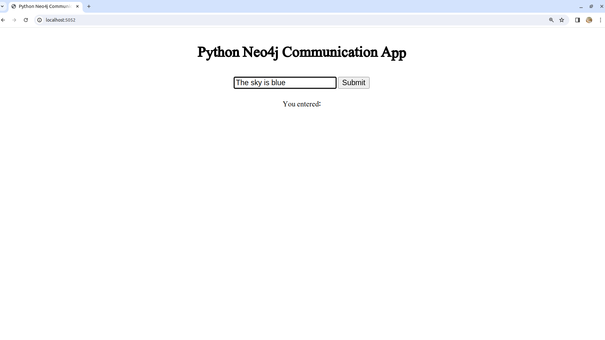
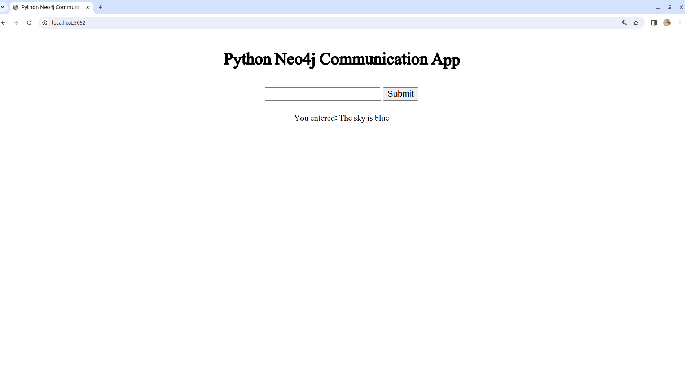
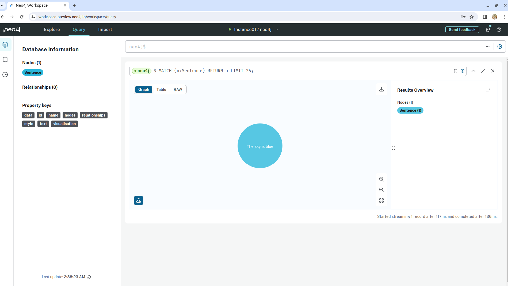

# Python Flask and Neo4j Aura Integration

## Overview

This application is a Flask-based web app that enables users to input text through a simple interface. Each submitted text is stored as a node in a Neo4j Aura graph database (a fully managed cloud graph database service), allowing for the creation and visualization of data in graph form.

## Features

- **Text Input Interface:** A simple web interface where users can submit text.
- **Neo4j Aura Integration:** Each piece of text submitted is stored as a node in a Neo4j Aura database.
- **Dockerization:** The app is containerized with Docker, making it easy to deploy and run in various environments.

## How It Works

### 1. Text Submission

The user enters text into a field on the web interface. Upon submission, this text is sent to the backend Flask application.

### Flask and Neo4j Interaction

This is a simple Python Flask app takes the submitted text and communicates with the Neo4j Aura database.

The app creates a new node for each text entered by the user under the `Sentence` label in the Neo4j database, with the text stored in a text property and a unique ID generated using Neo4j's `randomUUID()` function.

### Environment Variables

The application uses environment variables to handle Neo4j connection credentials. This ensures security and flexibility, to avoid hard-coded into the application.

### Dockerization

The application is Docker-ready, with a Dockerfile provided for building the Docker image. The Docker container runs the Flask app, making it easy to deploy the application consistently across different environments.

## Running the Application

**1. Setting Environment Variables:** We create and `.env` file and keep it's contents like:

```
ENV NEO4J_URI=connection-uri
ENV NEO4J_USER=username
ENV NEO4J_PASSWORD=password
AWS_ACCESS_KEY_ID=aws-access-key
AWS_SECRET_ACCESS_KEY=aws-secret-access-key
AWS_DEFAULT_REGION=aws-your-region
```


**2. Building the Docker Image:** Use the provided Dockerfile to build the Docker image of the application.

```
docker build -t neo4j-app:v1.1 .
```

**3. Running the Docker Container:** Run the Docker container with the necessary environment variables.

```
docker run -p 5052:5052 --env-file .env neo4j-app:v1.1
```

You will see output on console like below:

```shell
* Serving Flask app 'neo4j-app'
 * Debug mode: on
WARNING: This is a development server. Do not use it in a production deployment. Use a production WSGI server instead.
 * Running on all addresses (0.0.0.0)
 * Running on http://127.0.0.1:5052
 * Running on http://172.17.0.2:5052
Press CTRL+C to quit
 * Restarting with stat
 * Debugger is active!
 * Debugger PIN: 618-121-394
```

### Accessing Flask GUI inteface
 
Following is the interface of flask app




### Visualizing the Data in Neo4j Aura

After running the application and submitting text, you can visualize the created nodes in your Neo4j Aura database. Each node represents a submitted text, allowing you to see and analyze the data in a graph format.

Entering text:




Once the text is entered, we will see like:



Viewing the node in Neo4j




### Prerequisites for local computer execution of App

1. Neo4j Aura account and database.
2. Docker installed for containerization.
3. Python environment file `.env` for running the Flask application